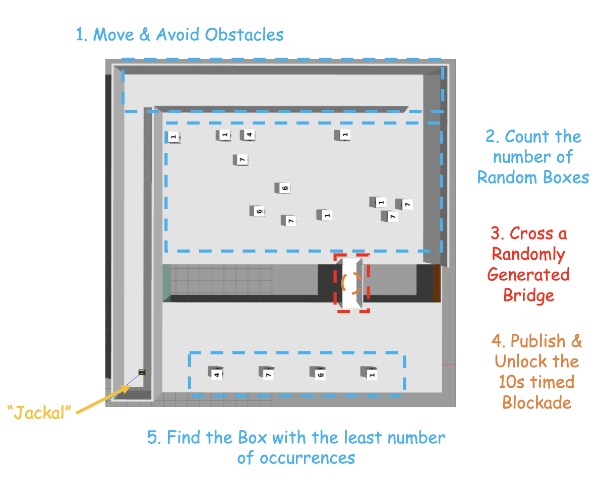
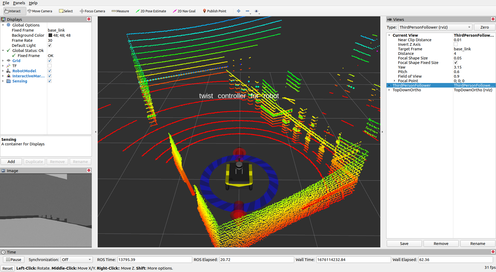
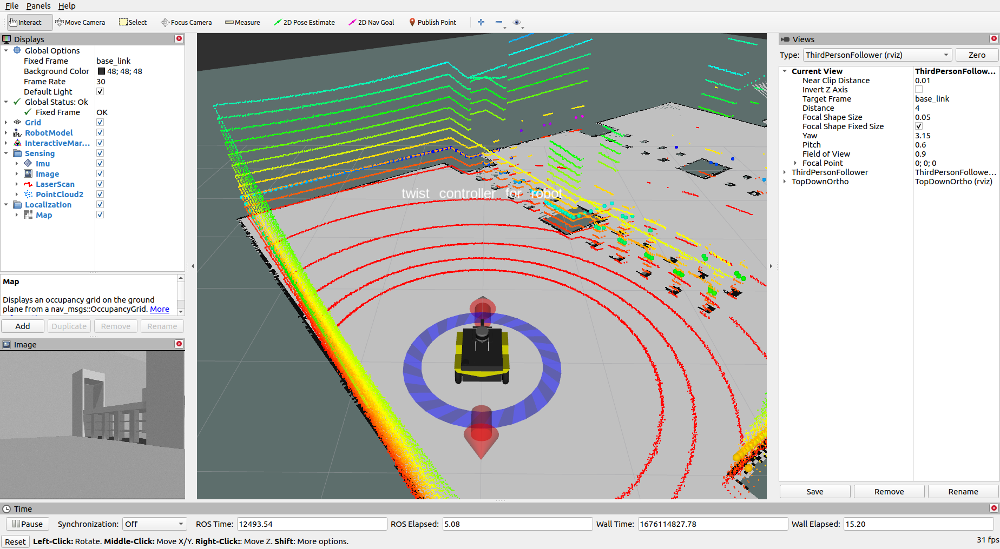

# ROS-Noetic Project

## Introduction

**Project Objectives**

This project based on ME5413_Final_Project of NUS.

The core goal of this project is to build a ROS-based system that enables the robot to:

1.  **Autonomous Navigation:** Navigate autonomously from the starting point to the target location within a given map.  
2.  **Dynamic Bridge Detection and Crossing:** Dynamically detect the position of bridges and safely cross them.  
3.  **Box Detection and Recognition:** Detect and recognize boxes with numbers in the environment, identifying their type (via the number) and position.  
4.  **Goal Orientation:** Determine specific goals, such as locating the least frequently appearing box, and navigate to it.  

**System Architecture**

The system consists of multiple ROS nodes, each responsible for a specific function:

*   **`sequential_goals.py` (Main Navigation Node):** This is the core control node of the entire system. It coordinates the operation of other nodes and implements the predefined task flow. It is mainly responsible for:
    *   **Task Decomposition:** Breaking down the overall task into a series of subtasks (e.g., navigate to the initial area, scan boxes, detect bridge, cross bridge, navigate to the target box).
    *   **State Management:** Maintaining the system state and performing different actions according to state transitions.
    *   **Action Coordination:** Coordinating the work of other nodes via ROS topics and services.
    *   **Navigation Goal Publishing:** Publishing navigation goals to the `move_base` node to control robot movement.
*   **`bridge_crosser.py` (Bridge Detection Node):** Responsible for detecting bridges on the map and providing their location to the system. It is mainly responsible for:
    *   **Map Analysis:** Analyzing map data to find potential bridge candidate areas.
    *   **Lidar Confirmation:** Verifying candidate areas using LIDAR data to confirm if they are actual bridges.
    *   **Location Publishing:** Publishing the detected bridge location to a ROS topic.
    *   **Unlock Command:** Sending unlock commands to allow the robot to cross.
*   **`box_detector.py` (Box Detection Node):** Responsible for detecting and recognizing boxes in the environment and providing their type and location to the system. It is mainly responsible for:
    *   **Image Processing:** Using camera images to detect boxes and recognize digits.
    *   **Lidar Assistance:** Assisting with position estimation using LIDAR data.
    *   **OCR:** Recognizing digits on boxes using OCR technology.
    *   **Position Estimation:** Estimating the position of the boxes in the global coordinate frame.
    *   **Data Publishing:** Publishing the detected box information to a ROS topic.
*   **`move_base` (Navigation Meta Node):** Provides core navigation functionality for the robot. It is mainly responsible for:
    *   **Path Planning:** Planning a global path from the current location to the target location based on map data.
    *   **Local Obstacle Avoidance:** Using sensor data (e.g., LIDAR) to detect obstacles and plan a local path to avoid them.
    *   **Motion Control:** Controlling the robot to follow the planned path and reach the target location.
*   **Other Nodes (`robot_pose_publisher`):** Provide pose estimation for the robot, based on odometry, LIDAR, or other sensor data.
*   **Rviz:** Visualization of results.

**Detailed Workflow**

1.  **Initialization:**
    *   Start all ROS nodes.
    *   The `bridge_crosser.py` node analyzes map data to find potential bridge candidate areas.
    *   The `box_detector.py` node initializes the camera and LIDAR sensors, preparing for box detection.
    *   The `move_base` node loads map data and configuration parameters, preparing for navigation.
2.  **Navigate to Initial Area:**
    *   The `sequential_goals.py` node retrieves the first navigation goal from the `initial_nav_points` list and creates a `MoveBaseGoal` message.
    *   The `sequential_goals.py` node sends the `MoveBaseGoal` message to the `move_base` node.
    *   The `move_base` node plans a global and local path from the current position to the target location and controls the robot to move.
    *   The robot follows the planned path until it reaches the target location.
3.  **Scan Pre-Bridge Area:**
    *   The `sequential_goals.py` node retrieves scan points from the `pre_bridge_scan_points` list and performs the following steps:
        *   Navigate to the scan point.
        *   Send a scan command to the `box_detector.py` node to start box detection.
        *   Wait for a period to allow `box_detector.py` to detect boxes and publish information.
        *   Stop box detection.
4.  **Detect Bridge:**
    *   The `sequential_goals.py` node sends a command to `bridge_crosser.py` to detect bridges.
    *   The `bridge_crosser.py` node analyzes map and LIDAR data to detect the bridge location.
    *   The `bridge_crosser.py` node publishes the detected bridge location to a ROS topic.
5.  **Cross the Bridge:**
    *   The `sequential_goals.py` node subscribes to the bridge location topic published by `bridge_crosser.py`.
    *   Based on the bridge location, it calculates the center of the bridge and sets a target point at a certain distance perpendicular to the center.
    *   The `sequential_goals.py` node creates a navigation goal and sends it to the `move_base` node.
    *   Unlock the obstacle.
    *   The `move_base` node controls the robot to cross the bridge.
6.  **Scan Post-Bridge Area:**
    *   Similar to scanning the pre-bridge area, the `sequential_goals.py` node retrieves scan points from the `post_bridge_scan_points` list and performs navigation and scanning operations in sequence.
7.  **Find the Least Frequently Appearing Box:**
    *   The `sequential_goals.py` node subscribes to the box type topic published by `box_detector.py`.
    *   It analyzes the data to find the least frequently appearing box and sets it as the target box.
8.  **Navigate to Target Box:**
    *   The `sequential_goals.py` node listens to the `/target_box_pose` topic, retrieves the position of the nearest box, creates a target goal, and sends it to the `move_base` node.
    *   The `move_base` node controls the robot to navigate near the target box.

**Technical Details**

* **Coordinate Transformation:** Uses TF to transform coordinates.
* **State Machine:** A simple state machine is implemented in `sequential_goals.py` for task planning.
* **Message Passing:** Uses topics for message transmission.
* **Behavior Control:** The main program calls subprograms to achieve system integration.




## Dependencies

* System Requirements:
  * Ubuntu 20.04 (18.04 not yet tested)
  * ROS Noetic (Melodic not yet tested)
  * C++11 and above
  * CMake: 3.0.2 and above
* This repo depends on the following standard ROS pkgs:
  * `roscpp`
  * `rospy`
  * `rviz`
  * `std_msgs`
  * `nav_msgs`
  * `geometry_msgs`
  * `visualization_msgs`
  * `tf2`
  * `tf2_ros`
  * `tf2_geometry_msgs`
  * `pluginlib`
  * `map_server`
  * `gazebo_ros`
  * `jsk_rviz_plugins`
  * `jackal_gazebo`
  * `jackal_navigation`
  * `velodyne_simulator`
  * `teleop_twist_keyboard`
* And this [gazebo_model](https://github.com/osrf/gazebo_models) repositiory

## Installation

This repo is a ros workspace, containing three rospkgs:

* `interactive_tools` are customized tools to interact with gazebo and your robot
* `jackal_description` contains the modified jackal robot model descriptions
* `me5413_world` the main pkg containing the gazebo world, and the launch files

**Note:** If you are working on this project, it is encouraged to fork this repository and work on your own fork!

After forking this repo to your own github:

```bash
# Clone your own fork of this repo (assuming home here `~/`)
cd
git clone https://github.com/<YOUR_GITHUB_USERNAME>/ME5413_Final_Project.git
cd ME5413_Final_Project

# Install all dependencies
rosdep install --from-paths src --ignore-src -r -y

# Build
catkin_make
# Source 
source devel/setup.bash
```

To properly load the gazebo world, you will need to have the necessary model files in the `~/.gazebo/models/` directory.

There are two sources of models needed:

* [Gazebo official models](https://github.com/osrf/gazebo_models)
  
  ```bash
  # Create the destination directory
  cd
  mkdir -p .gazebo/models

  # Clone the official gazebo models repo (assuming home here `~/`)
  git clone https://github.com/osrf/gazebo_models.git

  # Copy the models into the `~/.gazebo/models` directory
  cp -r ~/gazebo_models/* ~/.gazebo/models
  ```

* [Our customized models](https://github.com/NUS-Advanced-Robotics-Centre/ME5413_Final_Project/tree/main/src/me5413_world/models)

  ```bash
  # Copy the customized models into the `~/.gazebo/models` directory
  cp -r ~/ME5413_Final_Project/src/me5413_world/models/* ~/.gazebo/models
  ```
  
* [operation for additional dependence and package]

  ```bash
    sudo apt update
    sudo apt install tesseract-ocr

    pip install pytesseract
    pip install easyocr
  ```
  


## Usage

### 0. Gazebo World

This command will launch the gazebo with the project world

```bash
# Launch Gazebo World together with our robot
roslaunch me5413_world world.launch
```

### 1. Manual Control

If you wish to explore the gazebo world a bit, we provide you a way to manually control the robot around:

```bash
# Only launch the robot keyboard teleop control
roslaunch me5413_world manual.launch
```

**Note:** This robot keyboard teleop control is also included in all other launch files, so you don't need to launch this when you do mapping or navigation.



### 2. Mapping

After launching **Step 0**, in the second terminal:

```bash
# Launch GMapping
roslaunch me5413_world mapping.launch
```

After finishing mapping, run the following command in the thrid terminal to save the map:

```bash
# Save the map as `my_map` in the `maps/` folder
roscd me5413_world/maps/
rosrun map_server map_saver -f my_map map:=/map
```



### 3. Navigation

Once completed **Step 2** mapping and saved your map, quit the mapping process.

Then, in the second terminal:

```bash
# Load a map and launch AMCL localizer
roslaunch me5413_world navigation.launch
```


## Display the work that has been done so far
phase1_navigation_gif:

phase2_detection_gif:

phase2_navigation_gif:


